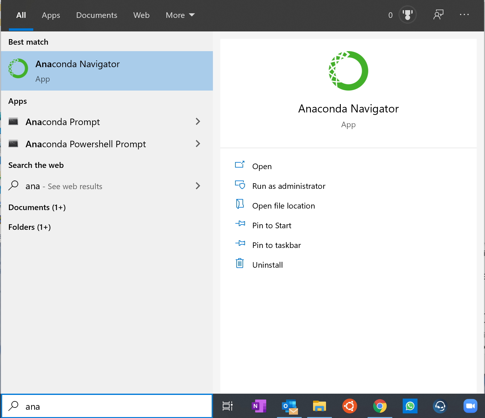
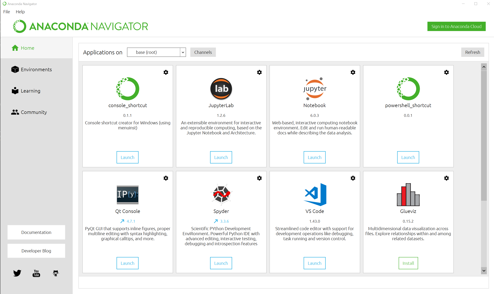
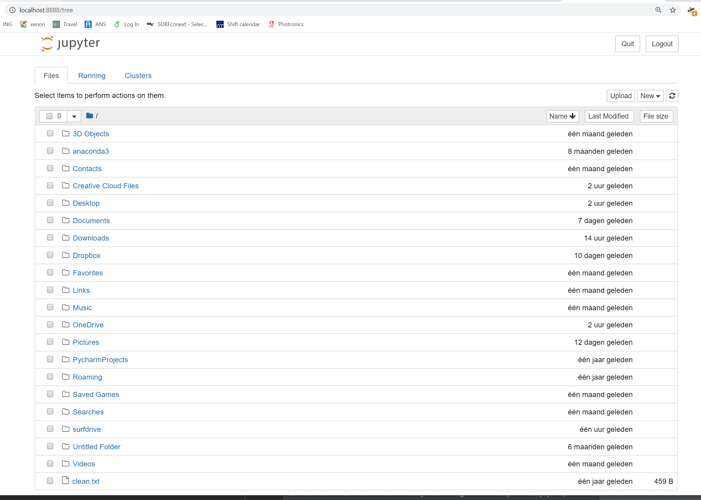

## Quantum in Python

De laptopcolleges bij QF1 zij nerop gericht om quantummechanica inzichtelijk te maken, en dan met name de 
tijdsafhankelijke oplossingen van de Schrodinger vergelijking. De reden om dit te doen in de vorm van een 
computer practicum is dat het met de hand oplossen van de tijdsafhenkelijke Schodinger vergelijking hel veel
werk is. Daarnaast is het nagenoeg onmogelijk om het dynamische gedrag van de oplossingen op waarde te schatten.

Het materiaal voor dit practicum bestaat uit een set jupyter notebooks die voro het grootste deel zijn geprepareerd
om direct met quantummechanica aan de slag te gaan. Het gaat hier niet primair om te oefenen van je programmeerskills, 
hoewel dat misschien een mooie bijvangst is.

## Software

### Anaconda

Via anaconda kan je direct een goede versie van python en Jupyter notebooks installeren. Zie 
[hier](https://progns.mprog.nl/naslag/installatie-computer) voor Anaconda installatie instructies. De meesten van 
jullie hebben Anaconda al geinstalleerd, en kunnen deze stap dus overslaan.

### Python

Alle code is gemaakt in python: net als voor het N&S proogrammeervak (Dubbele BSc stduenten hebben dit vak nog niet 
gehad, dus die gaan python leren on-the-fly). Met jullei Anaconda installatie hebben jullie ook een goede versie 
van python te pakken gekregen.

### Jupyter notebooks

Alle problemen zijn geschereven in python, die is ingebed in zogenaamde Jupyter notebooks. We gaan jullie vragen om 
deze notebooks ook te gebruiken. Dit is niet moeilijk, en voor het aanppakken van problemen extreem overzichtelijk. 
Documentatie voor de Jupyter notebooks [hier](https://jupyter-notebook.readthedocs.io/en/stable/notebook.html)

## Beginnen

Op een windows machine start "Anaconda Navigator" (op MAC iets soortgelijks, maar kan ik even niet testen)

{:style="max-width:30%"} 

Klik daarna op "Launch" Jupyter Notebook. 
{:style="max-width:50%"} 

Er start dan een Browser window waarin je kann navigeren naar de plek waar je je Jupter notebooks hebt geparkeerd.
{:style="max-width:50%"} 

